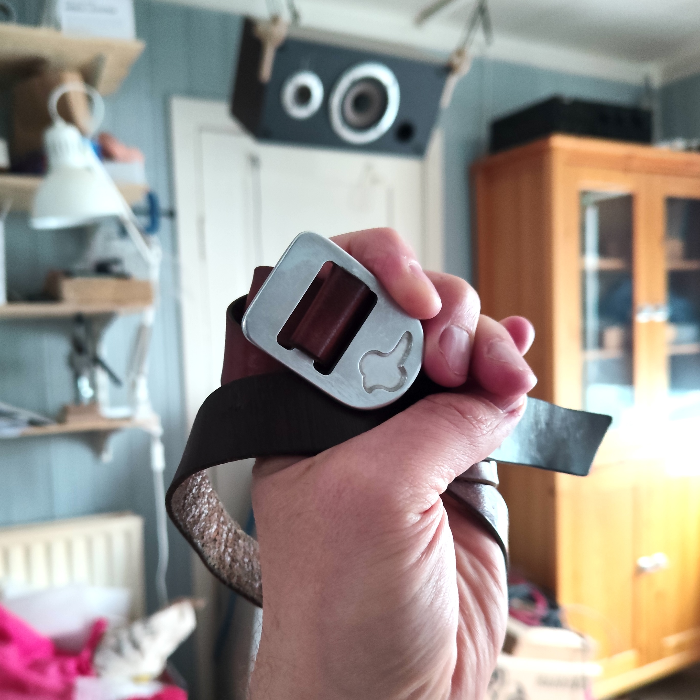

<h1 class="order-heading">Order of the Halldorophone</h1>

Unique leather belts featuring the halldorophone logo on an anodised aluminium buckle made by Halldór Úlfarsson are occasionally awarded to persons who have contributed in extraordinary ways to the evolution of halldorophones.

<h2 class="order-subheading">Holders of the Belt</h2>

In order of award

<h3>Halldór Úlfarsson</h3>

For inventing halldorophones

<h3>Arngrímur Guðmundsson</h3>

For his exceptional contribution to the development of halldorophones

<h3>Hildur Guðnadóttir</h3>

For making halldorophones infamous

<h3>Davíð Brynjar Franzson</h3>

For selfless service in bringing halldorophones to America

<h3>Thor Magnusson</h3>

For his wisdom and tutelage of Halldór Úlfarsson

