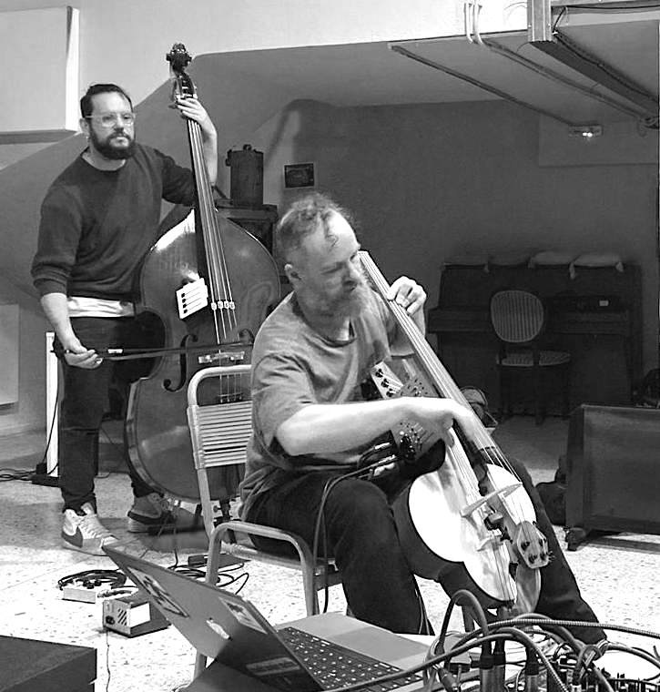
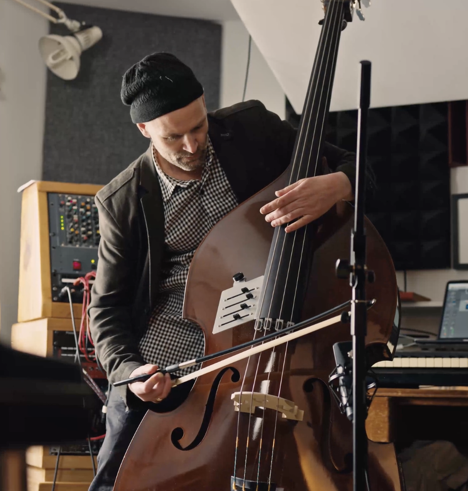

# Halldorobass

I always had the feeling that the lower register of the double bass would be awesome for feedback, and these instruments confirm it. The halldorobass is a double bass modified to feedback in the same way as halldorophones, with electromagnetic pickups detecting string vibrations, fed back through speaker mounted in the back of the instrument body to induce self-resonance. There are currently three of these instruments in active use.

---

### Instruments, in order of being made:

<h3>Adam Pultz Melbye and his FAAB</h3>

Adam Pultz Melbye is a Berlin-based double bass player, composer, audio programmer and researcher. In 2019 we got a small grant to prototype our idea for this instrument. The FAAB (Feedback Actuated Augmented Bass) features electromagnetic pickups, an embedded speaker and onboard DSP run on a Bela microprocessor. The physical construction follows the halldorophone method, the DSP with adaptive algorithms shaping the audio signal flow are developed by Adam and an equal part of the instrument's character. The FAAB was the subject of Adam's doctoral research at the Sonic Arts Research Centre, Queen's University Belfast (PhD, 2023).

[adampultz.com/faab](https://www.adampultz.com/faab)

<h3>Thanos Polymeneas-Liontiris</h3>

Thanos Polymeneas-Liontiris is a composer, performer, sound artist and double bass player, currently Associate Professor at the National and Kapodistrian University of Athens. We met while we were both doing our PhD under the supervision of Thor Magnusson at the University of Sussex, and are members of Emute LAB. Inspired by the halldorophone, Thanos independently developed a non-invasive feedback augmentation of the double bass, published as *Low Frequency Feedback Drones: A non-invasive augmentation of the double bass* at NIME 2018, before commissioning me to build him a dedicated instrument constructed to the halldorophone method. The instrument resides with him in Athens but he has generously provided access to interested musicians, most notably for fruitful collaboration between composer Constantine Skourlis and double bass player Otto Lindholm. Together with Alice Eldridge, Chris Kiefer and Thor Magnusson, Thanos was also part of the Brain Dead Ensemble (BDE), incorporating a feedback bass, they released the album *EFZ* on Confront Recordings.

<figure style="text-align:center; margin: 1rem 0;">

<figcaption style="font-size:0.75rem; font-style:italic; margin-top:0.4rem;">Thanos and Scott McLaughlin in Athens</figcaption>
</figure>

[thanospl.net](https://thanospl.net)

[Constantine Skourlis](https://constantineskourlis.bandcamp.com/)
[Otto Lindholm](http://www.ottolindholm.net/)

Released albums featuring this instrument:

[Otolith — Zappak](https://zappak.bandcamp.com/album/otolith)
[Tri N Os — Kohlhaas](https://kohlhaas.bandcamp.com/album/tri-n-os)
[EFZ — Confront Recordings](https://confrontrecordings.bandcamp.com/album/efz)

<h3>Tim Lea Young</h3>

Tim Lea Young is a Brighton-based composer, multi-instrumentalist and film/TV scorer working under the name M3ON. He commissioned a halldorobass from Úlfarsson and has used it in original work, including a commission for the Brighton Early Music Festival, performed on piano and halldorobass.

<figure style="text-align:center; margin: 1rem 0;">

<figcaption style="font-size:0.75rem; font-style:italic; margin-top:0.4rem;">Tim investigates his halldorobass</figcaption>
</figure>

[www.m3on.com](https://www.m3on.com/)

